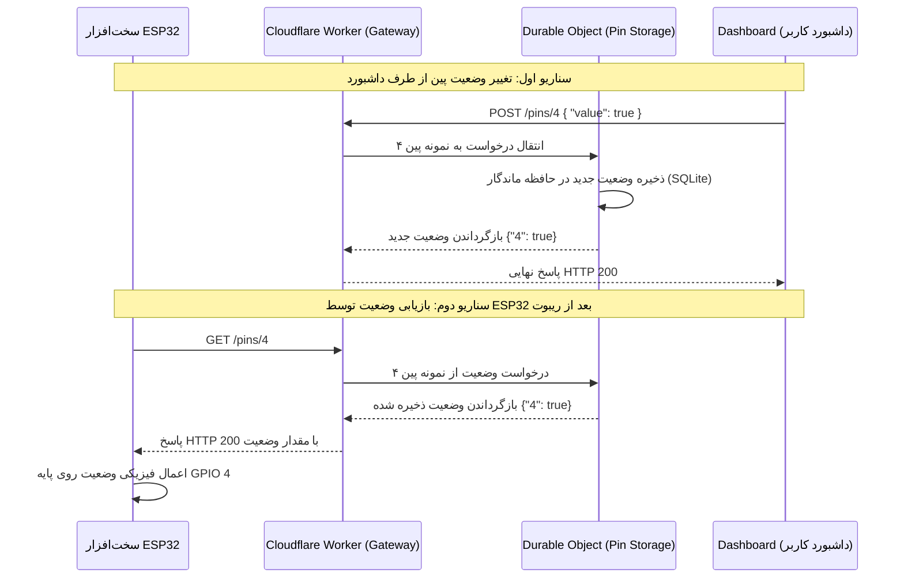

# راهنمای استفاده از API و نحوه کارکرد سیستم (Worker + Durable Object)

این مستند برای راهنمایی توسعه‌دهندگان جهت اتصال سخت‌افزار (ESP32) و داشبورد به بک‌اند کلودفلر (My Worker & Durable Object) تهیه شده است.

---

## ۱. نحوه کارکرد کلی سیستم (System Workflow)

معماری این سیستم بر پایه مدل **Pin-Centric (مبتنی بر پین)** طراحی شده است. هر پین فیزیکی روی ESP32 دارای یک نمونه ذخیره‌سازی مجزا در Durable Object کلودفلر است.



---

## ۲. مشخصات نقاط دسترسی (API Endpoints)

آدرس پایه سرور شما (برای مثال): `https://my-iot-worker.YOUR_SUBDOMAIN.workers.dev`

### الف) ثبت یا به‌روزرسانی وضعیت یک پین (POST)
زمانی که داشبورد یا خود ESP32 می‌خواهد وضعیت یک پایه را تغییر دهد، این درخواست را ارسال می‌کند.

*   **متد:** `POST`
*   **مسیر:** `/pins/{pin_id}` (مثال: `/pins/4`)
*   **هدرها:** `Content-Type: application/json`
*   **بدنه درخواست (JSON):**
    ```json
    {
      "value": true
    }
    ```
*   **پاسخ موفق (HTTP 200):**
    ```json
    {
      "4": true
    }
    ```

### ب) دریافت وضعیت فعلی یک پین (GET)
برای خواندن وضعیت ذخیره‌شده یک پین (مثلا هنگام روشن شدن ESP32).

*   **متد:** `GET`
*   **مسیر:** `/pins/{pin_id}` (مثال: `/pins/4`)
*   **پاسخ موفق (HTTP 200):**
    ```json
    {
      "4": true
    }
    ```
    *نکته: در صورتی که پین مورد نظر تا به حال مقداری نگرفته باشد، یک شیء خالی `{}` برمی‌گردد.*

---

## ۳. نحوه اتصال و کد نمونه برای ESP32 (Arduino C++)

برای اتصال ESP32 به این سرویس، می‌توانید از کتابخانه‌های پیش‌فرض `WiFi` و `HTTPClient` استفاده کنید. در زیر دو تابع کاربردی برای ارسال وضعیت و بازیابی وضعیت آورده شده است.

### نمونه کدهای آماده برای ESP32

```cpp
#include <WiFi.h>
#include <HTTPClient.h>
#include <ArduinoJson.h> // نیاز به نصب کتابخانه ArduinoJson دارد

const char* ssid = "YOUR_WIFI_SSID";
const char* password = "YOUR_WIFI_PASSWORD";
const char* serverUrl = "https://my-iot-worker.YOUR_SUBDOMAIN.workers.dev/pins/";

void setup() {
  Serial.begin(115200);
  WiFi.begin(ssid, password);
  
  while (WiFi.status() != WL_CONNECTED) {
    delay(500);
    Serial.print(".");
  }
  Serial.println("\nWiFi Connected!");

  // بازیابی وضعیت پین شماره ۴ از سرور در هنگام بوت شدن
  bool pinState = recoverPinState(4);
  pinMode(4, OUTPUT);
  digitalWrite(4, pinState ? HIGH : LOW);
  Serial.printf("Pin 4 recovered state: %s\n", pinState ? "ON" : "OFF");
}

void loop() {
  // مثال: هر ۱۰ ثانیه وضعیت پین ۴ را معکوس کرده و به سرور می‌فرستیم
  static unsigned long lastTime = 0;
  if (millis() - lastTime > 10000) {
    lastTime = millis();
    bool currentState = digitalRead(4);
    bool newState = !currentState;
    
    if (updatePinStateOnServer(4, newState)) {
      digitalWrite(4, newState ? HIGH : LOW);
      Serial.printf("Successfully updated Pin 4 to: %s\n", newState ? "ON" : "OFF");
    }
  }
}

// تابع بازیابی وضعیت پین از کلودفلر (GET)
bool recoverPinState(int pinId) {
  if (WiFi.status() == WL_CONNECTED) {
    HTTPClient http;
    String url = String(serverUrl) + String(pinId);
    http.begin(url);
    
    int httpResponseCode = http.GET();
    if (httpResponseCode == 200) {
      String payload = http.getString();
      StaticJsonDocument<128> doc;
      deserializeJson(doc, payload);
      
      // بررسی وجود کلید متناوب با پین در پاسخ JSON
      String pinKey = String(pinId);
      if (doc.containsKey(pinKey)) {
        return doc[pinKey].as<bool>();
      }
    } else {
      Serial.printf("Error on GET: %d\n", httpResponseCode);
    }
    http.end();
  }
  return false; // مقدار پیش‌فرض در صورت خطا
}

// تابع ارسال وضعیت پین به کلودفلر (POST)
bool updatePinStateOnServer(int pinId, bool value) {
  if (WiFi.status() == WL_CONNECTED) {
    HTTPClient http;
    String url = String(serverUrl) + String(pinId);
    http.begin(url);
    http.addHeader("Content-Type", "application/json");
    
    // ساخت بدنه JSON
    String requestBody = "{\"value\":" + String(value ? "true" : "false") + "}";
    
    int httpResponseCode = http.POST(requestBody);
    http.end();
    
    return httpResponseCode == 200;
  }
  return false;
}
```

---

## ۴. نحوه توسعه و افزودن ویژگی‌های جدید در آینده

این پروژه طوری بنا شده است که هر پین کاملاً ایزوله مدیریت می‌شود. 
*   **افزودن ماژول‌های چند‌پینه (مثل RGB LED):** کافیست وضعیت ۳ پین مربوطه (مثلاً پین‌های ۱۲، ۱۳ و ۱۴) را به صورت جداگانه با POST ذخیره و با GET بازیابی کنید.
*   **تغییر به وب‌سوکت (WebSocket):** در آینده برای سرعت بیشتر و ارتباط دوطرفه آنی، می‌توان پروتکل ارتباطی را به WebSocket ارتقا داد. ساختار Durable Object فعلی کاملاً از قابلیت وب‌سوکت کلودفلر پشتیبانی می‌کند.
